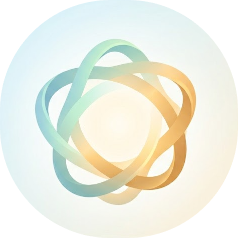

<p align="center">
  
</p>

<h3 align="center">
  birta
</h3>

<p align="center">
  <em>from the Icelandic word for brighten and publish, because that's what it does to your markdown.</em>
</p>

<p align="center">
  <sub>Live-reloading preview in your browser with GitHub-style rendering</sub>
</p>

<p align="center">
  <a href="https://crates.io/crates/birta">
    
  </a>
  &nbsp;
  <a href="https://github.com/hugvit/homebrew-tap">
    
  </a>
  &nbsp;
  <a href="https://github.com/hugvit/birta/blob/main/LICENSE">
    
  </a>
</p>

<!-- TODO: Add hero screenshot
<p align="center">
  <picture>
    <source media="(prefers-color-scheme: dark)" srcset="https://raw.githubusercontent.com/hugvit/birta/main/assets/readme/screenshot-dark.png"/>
    <source media="(prefers-color-scheme: light)" srcset="https://raw.githubusercontent.com/hugvit/birta/main/assets/readme/screenshot-light.png"/>
    
  </picture>
</p>
-->

&nbsp;

## Features

- **GitHub-style rendering** — full GFM compliance via comrak, including tables, task lists, footnotes, alerts, and math
- **Live reload** — file changes push to the browser instantly over WebSocket
- **Raw mode** — toggle between rendered preview and syntax-highlighted source with line numbers
- **11 bundled themes** — github, catppuccin, dracula, gruvbox, nord, rose-pine, tokyo-night, and more, with runtime hot-swap
- **Syntax highlighting** — server-side via syntect, with per-theme tmTheme support
- **Reading mode** — distraction-free viewing with scroll progress indicator
- **Single binary** — no runtime dependencies, no Node.js, no Python
- **Directory navigation** — relative markdown links are clickable, letting you browse across files in a project
- **Interactive checkboxes** — click task list items in the browser to toggle them in the source file
- **Stdin support** — pipe markdown from any source: `cat notes.md | birta -`

&nbsp;

## Quick Start

```bash
cargo install birta
birta README.md
```

Your browser opens with a live preview. Edit the file — the browser updates automatically.

&nbsp;

## Installation

<details open>
<summary>Cargo</summary>

```bash
cargo install birta
```

</details>

<details>
<summary>Homebrew</summary>

```bash
brew install hugvit/tap/birta
```

</details>

<details>
<summary>From source</summary>

```bash
git clone https://github.com/hugvit/birta.git
cd birta
cargo install --path .
```

</details>

&nbsp;

## Usage

Preview a file with the default theme (github):

```bash
birta README.md
```

Use a specific theme in light mode:

```bash
birta --theme catppuccin --light README.md
```

View the raw markdown source with syntax highlighting:

```bash
birta --raw README.md
```

Distraction-free reading:

```bash
birta --reading-mode --no-header README.md
```

Preview from stdin:

```bash
cat notes.md | birta -
```

List all available themes:

```bash
birta --list-themes
```

Run `birta --help` for the full flag reference.

&nbsp;

## Themes

<!-- TODO: Add theme screenshots in accordions
<details>
<summary>GitHub (default)</summary>

</details>

<details>
<summary>Catppuccin</summary>

</details>

<details>
<summary>Dracula</summary>

</details>
-->

Bundled: `github` `catppuccin` `dracula` `gruvbox` `monokai` `night-owl` `nord` `one-dark` `rose-pine` `synthwave-84` `tokyo-night`

Themes with both light and dark variants get a toggle in the header. Switch themes at runtime from the dropdown — no restart needed.

Custom themes go in `~/.config/birta/themes/` as TOML files. See the [bundled themes](https://github.com/hugvit/birta/tree/main/assets/themes) for the format.

&nbsp;

## Configuration

Persistent settings live in `~/.config/birta/config.toml`:

```toml
port = 3000

[theme]
name = "catppuccin"

[font]
body = "Georgia, serif"
mono = "JetBrains Mono, monospace"

[keybindings]
toggle_reading = "r"       # reading mode
toggle_dark = "d"          # light/dark toggle
toggle_raw = "u"           # preview/raw toggle
focus_theme = "t"          # open theme picker
```

All settings can be overridden with CLI flags. Keybindings support modifiers: `--bind toggle_raw=Alt+u`. Run `birta --help` for the complete list.

&nbsp;

## Neovim

The Neovim plugin lives in a separate repo: [birta.nvim](https://github.com/hugvit/birta.nvim)

```lua
-- lazy.nvim
{
  "hugvit/birta.nvim",
  cmd = { "BirtaPreview", "BirtaStop", "BirtaToggle" },
  opts = {
    theme = "catppuccin",
  },
}
```

&nbsp;

## License

[MIT](LICENSE)
