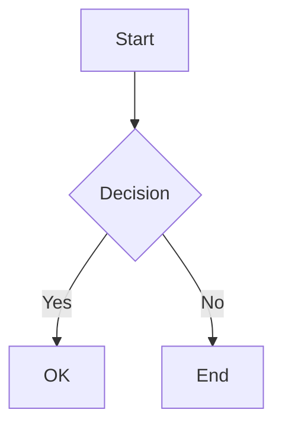

# Kitchen Sink

Every supported feature in one document.

## Inline Formatting

**Bold**, _italic_, **_bold italic_**, ~~strikethrough~~, `inline code`.

## Links

[Regular link](https://example.com), auto-linked https://example.com, and [reference link][ref].

[ref]: https://example.com "Example"

## Images


## Headings

### Third Level

#### Fourth Level

##### Fifth Level

###### Sixth Level

## Lists

### Unordered

- Item one
  - Nested item
    - Deeply nested
- Item two

### Ordered

1. First
2. Second
3. Third

### Task List

- [x] Completed task
- [ ] Incomplete task

### Description List

Term
: Definition of the term

Another term
: Its definition

## Table

| Feature             | Status | Notes     |
| ------------------- | ------ | --------- |
| Rendering           | Done   | comrak    |
| Live reload         | Done   | WebSocket |
| Syntax highlighting | Done   | syntect   |

## Code Blocks

```rust
fn main() {
    println!("Hello, sheen!");
}
```

```python
def greet(name: str) -> str:
    return f"Hello, {name}!"
```

```
Plain code block with no language specified.
```

## Blockquote

> Simple blockquote.
>
> With multiple paragraphs.

> > Nested blockquote.

## Alerts

> [!NOTE]
> This is a note alert.

> [!TIP]
> This is a tip alert.

> [!IMPORTANT]
> This is an important alert.

> [!WARNING]
> This is a warning alert.

> [!CAUTION]
> This is a caution alert.

## Footnotes

Text with a footnote[^1] and another[^named].

[^1]: First footnote.

[^named]: A named footnote with **bold**.

## Interactive Elements

<details>
<summary>Click to expand</summary>

Hidden content with a [link](https://example.com) and **bold**.

</details>

## Horizontal Rule

---

## Emoji Shortcodes

:wave: :rocket: :sparkles:

## HTML Passthrough

<div align="center">
  <em>Centered italic text via raw HTML</em>
</div>

## Autolink

Visit https://example.com or email user@example.com.

## Math

Inline math: $E = mc^2$

Display math:

$$
\int_{-\infty}^{\infty} e^{-x^2} dx = \sqrt{\pi}
$$

Code-style inline: $`\alpha + \beta`$

Code-style display:

```math
\sum_{i=1}^{n} i = \frac{n(n+1)}{2}
```

Mixed: The equation $a^2 + b^2 = c^2$ is well known.

## Mermaid Diagrams


